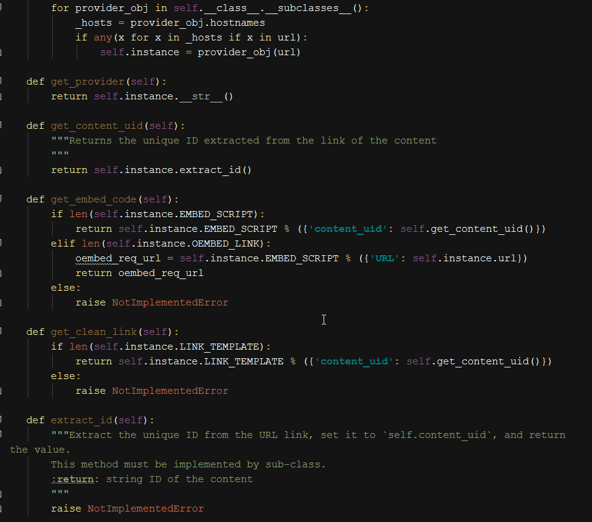
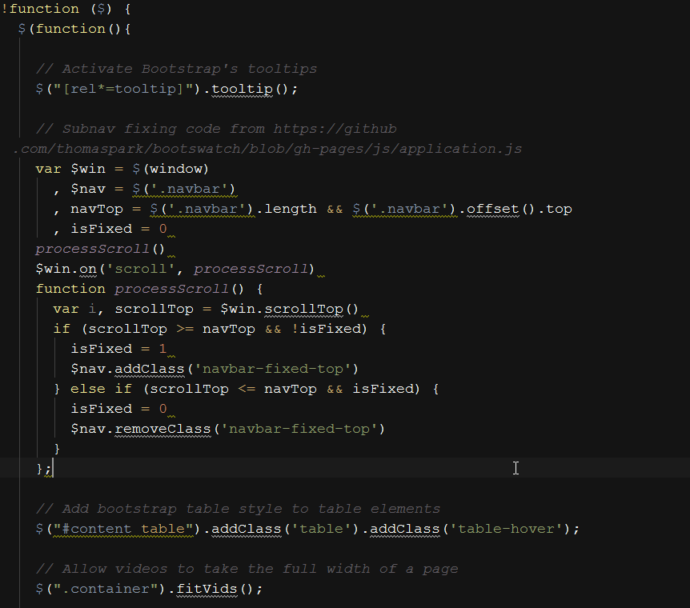
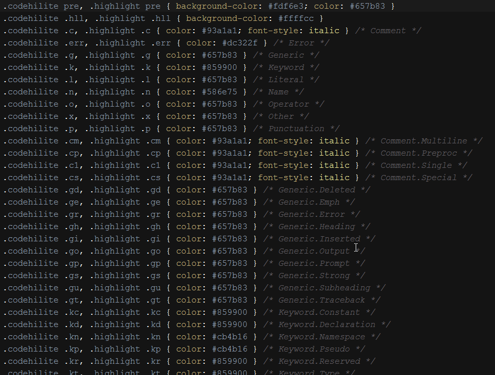

## A Pycharm port of the Textmate theme Twilight

A big thanks goes out to Michael Sheets, the original author of the `Twilight` theme.

### Screenshots

#### Python

#### JavaScript

#### CSS

## Installation

### jar
**Go to menu: File >> "Import settings" and select `Twilight.jar`.  It should work for all Platforms.**

### xml

##### NOTE: The xml file will be deprecated at some point.

 * **OS X**: Place Twilight.xml in ~/Library/Preferences/PyCharm10/colors/ and restart your IDE
 * **Linux**: Place Twilight.xml in  ~/.PyCharm10/config/color and restart your IDE (thanks @thierrystiegler)
 * **Windows Vista (maybe Win7)**: Place Twilight.xml in C:\Users\YourUserNameHere\.PyCharm10\config\colors (thanks Steve Young)
 * **Windows XP**: Place `Twilight.xml` in `C:\Dokumente und Einstellungen\<user name>\.PyCharm10\config\colors (im Deutsch, danke Jens Trommler)

----------

If something doesn't look right, contact me on twitter @nek4life or send me an email at the same username @ gmail.com.
